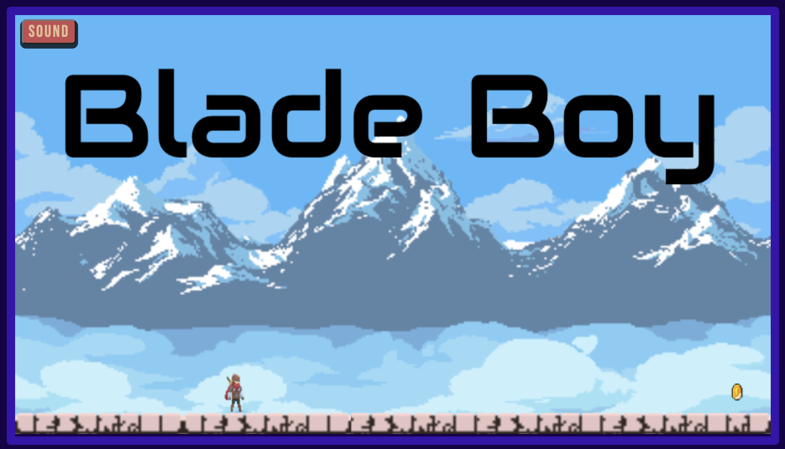

## A JavaScript Platformer
[Check It Out](https://dbsaiyan1321.github.io/blade-boy/)

You are someone who just needs to pay rent, but you realized that you don't have any money because you spent it all on a cool outfit. You only have one way of getting money now... Going to the mountains and risking your life for gold coins to sell. That's the only chance you have. 

## Technologies 
* JavaScript
* HTML5 Canvas

## Gameplay


Controls: 
* A or Left arrow to run left
* D or Right arrow to run right
* W or Up arrow to jump 

Game Goals: 
1. Don't die
2. Get those gold coins
3. PAY RENT!!!

## Implementation

```javascript
collidedWith(platforms, goal) { 
   for (let i = 0; i < platforms.length; i++) { 
        let platform = platforms[i];

        if (this.y > platform.bottom || this.bottom < platform.y || this.x > platform.right || this.right < platform.x) continue;

        if (this.y <= platform.bottom && this.ot > platform.bottom) {
            this.y = platform.bottom + 0.1;
            this.velocityY = 0;
        } else if (this.bottom >= platform.y && this.ob < platform.y) {
            this.y = platform.y - this.height - 0.1; 
            this.velocityY = 0; 
            this.jumping = false;
            this.jumpFrame = 0; 
            this.grounded = true; 
        } else if (this.x <= platform.right && this.ol > platform.right) {
            this.x = platform.right + 0.1;
            this.velocityX = 0;
        } else if (this.right >= platform.x && this.or < platform.x) {
            this.x = platform.x - this.width - 0.1; 
            this.velocityX = 0;
        }
    }
    
    if (this.y > goal.bottom || this.bottom < goal.top || this.x > goal.right || this.right < goal.left) return false;

    return true 
}
```


```javascript 
class Level { 
    constructor(ctx, player) {
        this.rows = 20;
        this.cols = 36;
        this.tileSize = 25;
        this.tiles = [
            { x: -1, y: 0 }, { x: -1, y: 0 }, { x: -1, y: 0 }, ...,
            ...
        ];

        this.platforms = [];

        ...this.init(ctx)
    }

    init(ctx) {
        for (let c = 0; c < this.cols; c++) {
            for (let r = 0; r < this.rows; r++) {
                let tile = this.getTile(c, r);
                if (tile.x !== -1) {
                    this.platforms.push(new Platform(
                        tile.x, // sprite sheet x
                        tile.y, // sprite sheet y
                        8, // sprite sheet width
                        8, // sprite sheet height
                        c * this.tileSize, // Canvas x
                        r * this.tileSize, // Canvas y
                        this.tileSize, // Canvas width
                        this.tileSize // Canvas height
                    ));
                }
            }
        }
    }
    
    ...
}
```

## Future Features 
* Timer
* Obstacles
* More Levels 
